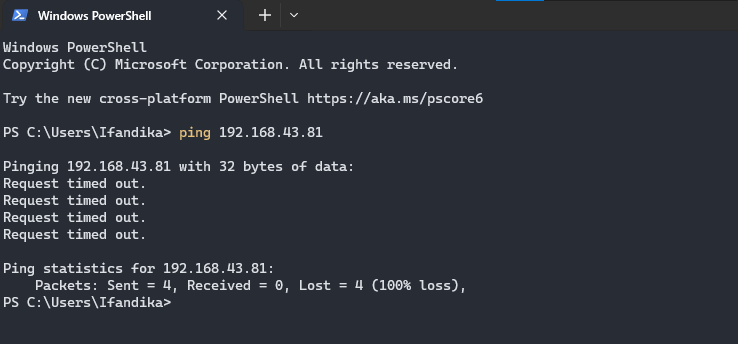

# Instalasi dan Konfigurasi Iptables Debian11.3

> By Maulana Ifandika

## Pengertian


## Instalasi dan Konfigurasi Iptables
Instalasi ini Debian sebagai server DNS (Perlu konfigurasi bind9) agar trafik dari PC Windows melewati Debian. Di Debian akan diinstal Iptables, untuk percobaan ini mencoba memblokir ping dari klien PC Windows. Untuk awal bisa konfigurasi Network Interface.
```Text
$ nano /etc/network/interfaces
```


Lalu restart network.

```Text
$ /etc/init.d/networking restart
```
Kemudian cek IP yang didapat.

```Text
$ ip a
$ ifconfig (Perlu install net-tools)
```


Lalu kita konfigurasi DNS dengan Bind9, jika belum menginstall maka install dulu.

```Text
$ apt update
$ apt upgrade
$ apt install bind9 bind9utils dnsutils
```
Untuk konfigurasi Bind9 sebagai DNS Server [Instalasi dan Konfigurasi Bind9](https://github.com/ifandika/Instalasi-Konfigurasi-Bind9-Debian11.3-Virtualbox)

Jika sudah kita instal Iptables.

```Text
$ apt install iptables
```
Jika muncul input Y/n tekan Y/y, jika sudah menginstal.


Lalu buat file **rc.local** di **/etc/rc.local** untuk file yang akan mengambil file script **firewall.sh** yang nanti dibut di **/opt/firewall.sh**.

```Text
$ touch /etc/rc.local
```
Lalu masuk dengan teks editor nano.

```Text
$ nano /etc/rc.local
```
Lalu isi seperti ini.


Kemudian kita buat menjadi service.

```Text
$ chmod +x /etc/rc.local
$ systemctl daemon-reload
$ systemctl restart rc-local
$ systemctl status rc-local
```


Lalu buat file **firewall.sh**.

```Text
$ touch /opt/firewall.sh
```
Lalu buka dengan teks editor nano.
```Text
$ nano /opt/firewall.sh
```
Lalu isi sesuaikan dengan apa yang akan di blokir, untuk pernyataan pertama wajib lalu sisanya opsional.


Lalu kita berikan akses untuk filenya, dan jalankan filenya.
```Text
$ chmod +x /opt/firewall.sh
$ sudo sh /opt/firewall.sh (Perlu sudo untuk akses iptables)
```
Lalu ke klien PC Windows dan masuk ke setting Adapter **(Control Panel\Network and Internet\Network Connections)** dan pilih adapter yang menjadi sumber internet, disini menggunakan Wireless/Wi-Fi maka pilih **Wireless**, lalu masukan IP debian ke DNS.


Jika sudah coba cek ping dari Windows apakah terblokir.



Kemudian coba kita matikan blokir ping.
```Text
$ nano /opt/firewall.sh
```
Kemudian beri komen(#) pada code iptables yang memblokir ping. 


Lalu jalankan lagi **firewall.sh** & restart service **rc-local**, lalu tunggu beberapa menit untuk proses perubahannya.
```Text
$ sudo sh /opt/firewall.sh
$ systemctl restart rc-local
```
Kemudian coba ping ke IP Debian, maka otomtis ping akan berhasil/reply.


### Catatan !!!!
Jika masih bisa ping coba jalankan file **firewall.sh** dan restart service **rc-local**, kemudian restart/reboot Debian.
```Text
$ sudo sh /opt/firewall.sh
$ systemctl restart rc-local
$ reboot (Jika GUI bisa dengan tombol Power)
```

